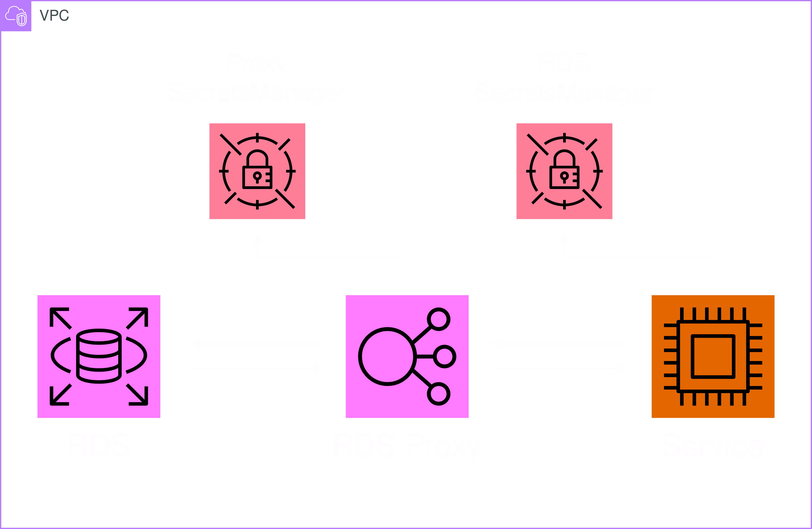

# Module: Database



This module provides a PostgreSQL RDS instance, an optional RDS proxy and a SecretsManager holding the connection secrets to the database.

## Contents

- [Requirements](#requirements)
- [Inputs](#inputs)
- [Outputs](#outputs)
- [Example](#example)
- [Contributing](#contributing)

## Requirements

| Name      | Version  |
| --------- | -------- |
| terraform | >= 1.0   |
| aws       | >= 5.20  |
| random    | >= 3.6.0 |

## Inputs

| Name                | Description                                                                                                                                                                                                                                         | Type           | Default                    | Required |
| ------------------- | --------------------------------------------------------------------------------------------------------------------------------------------------------------------------------------------------------------------------------------------------- | -------------- | -------------------------- | :------: |
| identifier          | Unique identifier to differentiate global resources.                                                                                                                                                                                                | `string`       | n/a                        |   yes    |
| name                | Name of this module, which is used as identifier on all resources.                                                                                                                                                                                  | `string`       | ""                         |    no    |
| instance_class      | The instance class of the RDS instance. Must be one of the [supported RDS instance classes](https://docs.aws.amazon.com/AmazonRDS/latest/UserGuide/Concepts.DBInstanceClass.html).                                                                  | `string`       | "db.t3.micro"              |    no    |
| engine_version      | The PostgreSQL engine version for the RDS instance. Must be one of the [supported RDS postgres engine versions](https://docs.aws.amazon.com/AmazonRDS/latest/UserGuide/CHAP_PostgreSQL.html#PostgreSQL.Concepts.General.FeatureSupport.Extensions). | `string`       | "16.1"                     |    no    |
| allocated_storage   | Storage capacity of the RDS instance in GigiBytes.                                                                                                                                                                                                  | `number`       | 20                         |    no    |
| vpc                 | ID of the subnets' VPC.                                                                                                                                                                                                                             | `string`       | n/a                        |   yes    |
| subnets             | A list of IDs of subnets for the subnet group and potentially the RDS proxy.                                                                                                                                                                        | `list(string)` | n/a                        |   yes    |
| skip_final_snapshot | A flag for wether or not skipping the creation of a final snapshot befor deletion of the RDS instance.                                                                                                                                              | `bool`         | true                       |    no    |
| db_name             | Name of the database initially created in the RDS instance.                                                                                                                                                                                         | `string`       | "postgres"                 |    no    |
| db_username         | Username of the master user in the RDS instance.                                                                                                                                                                                                    | `string`       | "postgres"                 |    no    |
| db_password         | Password of the master user in the RDS instance.                                                                                                                                                                                                    | `string`       | random 32 character string |    no    |
| proxy               | An object for the definition of a RDS proxy for the RDS instance.                                                                                                                                                                                   | `object`       | null                       |    no    |
| tags                | A map of tags to add to all resources.                                                                                                                                                                                                              | `map(string)`  | {}                         |    no    |

### `proxy`

| Name                         | Description                                                                                                                                                                                                                                                                                                       | Type     | Default | Required |
| ---------------------------- | ----------------------------------------------------------------------------------------------------------------------------------------------------------------------------------------------------------------------------------------------------------------------------------------------------------------- | -------- | ------- | :------: |
| debug_logging                | A flag whether or not the proxy includes detailed information about SQL statements in its logs.                                                                                                                                                                                                                   | `bool`   | n/a     |   yes    |
| idle_client_timeout          | The number of seconds that a connection to the proxy can be inactive before the proxy disconnects it.                                                                                                                                                                                                             | `number` | n/a     |   yes    |
| connection_borrow_timeout    | The number of seconds for a proxy to wait for a connection to become available in the connection pool. Only applies when the proxy has opened its maximum number of connections and all connections are busy with client sessions.                                                                                | `number` | n/a     |   yes    |
| max_connections_percent      | The maximum size of the connection pool for each target in a target group.                                                                                                                                                                                                                                        | `number` | n/a     |   yes    |
| max_idle_connections_percent | Controls how actively the proxy closes idle database connections in the connection pool. A high value enables the proxy to leave a high percentage of idle connections open. A low value causes the proxy to close idle client connections and return the underlying database connections to the connection pool. | `number` | n/a     |   yes    |

## Outputs

| Name           | Description                                                                               |
| -------------- | ----------------------------------------------------------------------------------------- |
| security_group | The ID of the security group to allow services access to the RDS instance.                |
| secrets_arn    | The ARN of the SecretsManager which holds secrets for the connection to the RDS instance. |

## Example

```hcl
module "database" {
  source = "github.com/custom-terraform-aws-modules/database"

  identifier          = "example-database-dev"
  instance_class      = "db.t3.micro"
  engine_version      = "16.1"
  allocated_storage   = 20
  vpc                 = "vpc-01234567890abcdef"
  subnets             = ["subnet-1242421", "subnet-2344898"]
  skip_final_snapshot = true
  db_name             = "postgres"
  db_username         = "postgres"
  db_password         = "password"

  proxy = {
    debug_logging                = false
    idle_client_timeout          = 1800
    connection_borrow_timeout    = 120
    max_connections_percent      = 100
    max_idle_connections_percent = 50
  }

  tags = {
    Project     = "example-project"
    Environment = "dev"
  }
}
```

## Contributing

In order for an efficient CI workflow copy the `pre-commit` git hook from `.github/hooks` into your local `.git/hooks`. The hook formats the terraform code automatically before each commit.

```bash
cp ./.github/hooks/pre-commit ./.git/hooks/pre-commit
```
